# School District Analysis

## Overview:
---

Maria, the chief data scientist at a city school district is responsible for analysing test data for the schools in the district. Being new to the team, Maria has tasked me with gathering the data and reformating it for analysis to test out my skills. After gathering school and distric level data on several criteria, the school board now suspects that there has been some academic dishonesty; specifically, reading and writing scores for Thomas High School's ninth grade class. Not knowing the full extent of the academic dishonesty, the school board has turned to Maria and I for help upholding the state-testing standards. Maria has asked me to remove the Thomas High School's ninth grade class's test results and to repeat the school disctrict analysis to see if there is any change.

### Metrics Reviewed:
In total, we reviewed 7 metrics for our analysis before and after removing the Thomas High ninth grade class results.
-   Total Students
-   Total Budget
-   Average Math Scores
-   Average Reading Scores
-   % Passing Math
-   % Passing Reading
-   % Passing Overall

## Results:
---
First we looked at the effect of removing the Thomas High School (THS) 9th grade student scores out of the picture in order to see what impact it would have at the distric level. Seen below, there was a marginal drop in the average math score and passing percentages. 

Total District Summary
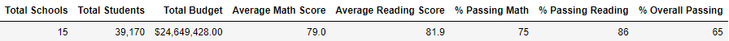

District Summary - without THS 9th grade class
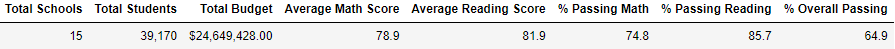

---

Next we reviewed how Thomas High School (THS) was effected in comparison to the other schools after removing the 9th grade class. Seen below, there are again marginal differences before and after the 9th grade score removal. We see lass than 1 point difference in both math and reading as well as less than a 1% difference in passing percentage. 

Total School Summary
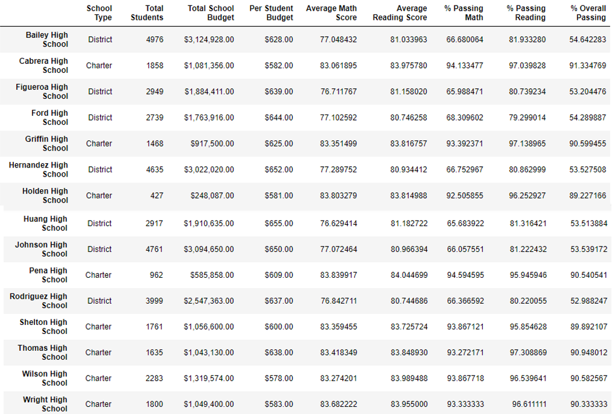

School Summary - without THS 9th grade class
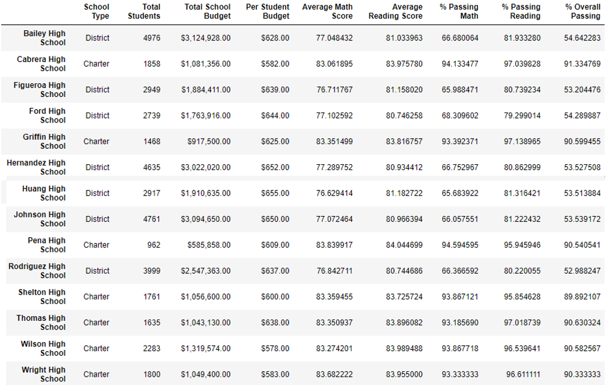

---

Finally, we compared scores by grade, scores by school spending, scores by school size and scores by school type. Here are a breakdown of those results

### Math and reading scores by grade

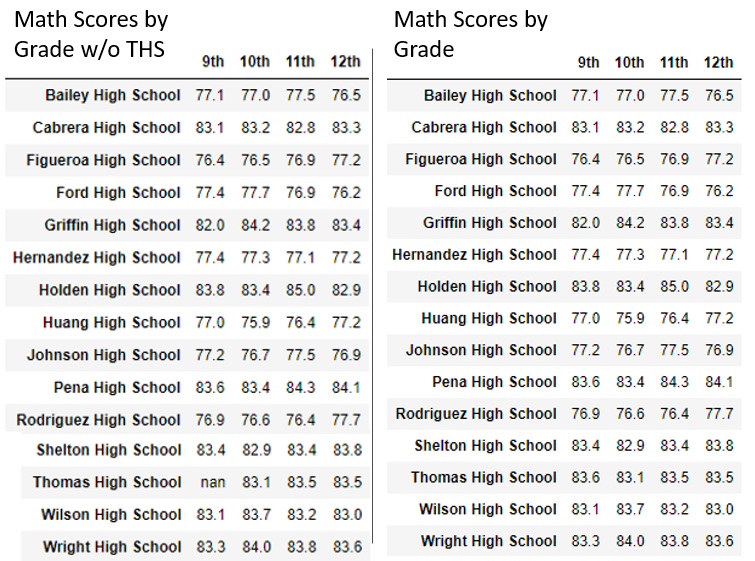

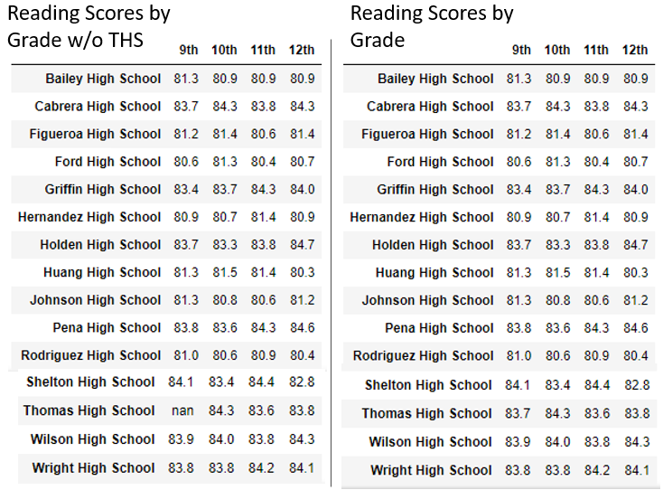

Summary by School Spending
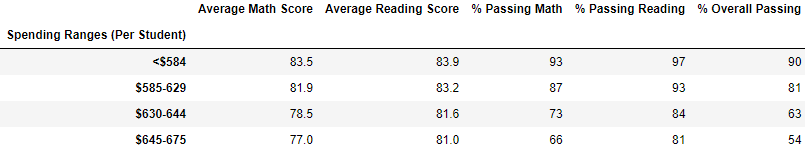
Summary by School Spending - without THS 9th grade class
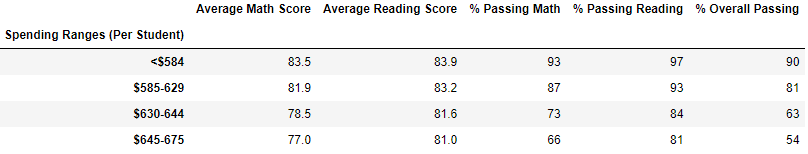

Summary by School Size
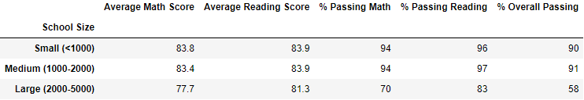
Summary by School Size - without THS 9th grade
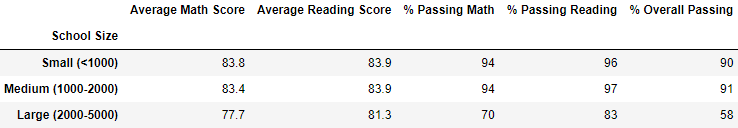

Summary by School Type

Summary by School Type - without THS 9th grade
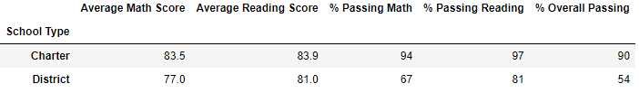

---

## Summary:

In conclusion, after thorough analysis of the test scores across the district the assumption of academic dishonestly from the Thomas High ninth grade class has come back inconclusive. While there are minor changes in the data such as marginally lower reading and math scores as well as marginally lower passing percentages, the cxhanges are insubrantial to claim academic dishonesty. Additionally, while reviewing the district wide data, the 461 9th graders from THS make up less than 2% of the overall school population in the disrict and ultimately have no effect on the district level numbers. 